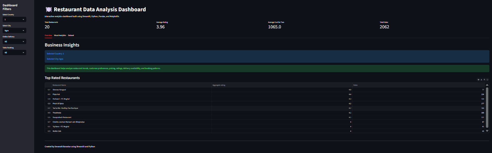

# 🍽️ Restaurant Data Analysis Dashboard

An interactive web-based data analytics dashboard built using **Streamlit and Python** to explore restaurant trends, customer behavior, ratings, pricing, and service patterns from a large dataset.

## 📊 Project Overview

This project analyzes restaurant data to extract meaningful business insights such as top cuisines, customer ratings, delivery preferences, and pricing patterns.  
The dashboard is fully interactive and allows users to filter data dynamically by country, city, and service options.

## ✨ Key Features

- Interactive Streamlit dashboard
- Country and city-based filtering
- KPI metrics (ratings, votes, cost, total restaurants)
- Cuisine popularity analysis
- Online delivery and table booking insights
- Ratings and price distribution analysis
- Interactive charts and visual storytelling
- Clean and user-friendly UI with tabs and sidebar filters

## 🛠️ Technologies Used

- Python  
- Streamlit  
- Pandas  
- Matplotlib  

## 📷 Dashboard Preview

## 📁 Project Files

- `app.py` → Main Streamlit application  
- `analysis.ipynb` → Data analysis notebook  
- `requirements.txt` → Required dependencies  
- `dashboard_screenshot.png` → UI preview image  

## 🚀 How to Run Locally

Install dependencies:
pip install -r requirements.txt

Run the app:
streamlit run app.py

## 🔮 Future Improvements
- Add predictive analytics for restaurant ratings
- Deploy on Streamlit Cloud
- Add map-based visualization
- Integrate real-time datasets

## 👩‍💻 Author
Devanshi Baraskar